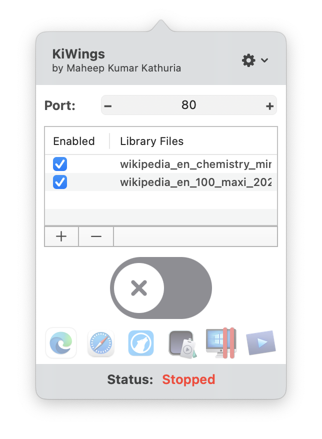
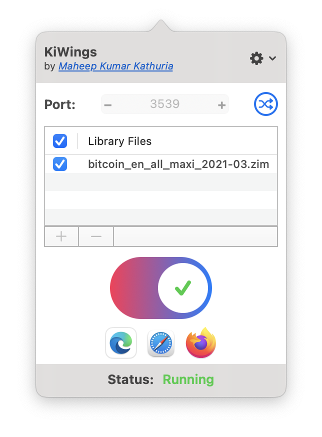

#  KiWings

## Introduction
KiWings is a lightweight Kiwix alternative for macOS. Kiwix is an open-source tool that allows you to read offline copies of fantastic content like Wikipedia (its a 80GB download), TED Talks etc. Originally, I started working on this tool to learn UI development on macOS, an endeavor that continues to this day. But this tool has now become a full-fledged project itself.

Under the hood, this tool is a front-end for `kiwix-serve` designed for macOS 11.3 and later. `kiwix-serve` is a tool designed by Kiwix team, which can work as a standalone content server, but as of writing this, is not directly released as macOS binary, though compilation is supported.

**🔥WARNING: Bugs and shortcomings are unfortunately commonplace in software. On my part, I'm releasing the tool as a sandboxed app (meaning macOS will restrict its capabilities to do any damage), but this tool is RELEASED AS IS, WITH NO WARRANTY - IMPLIED OR OTHERWISE.**

## Features
- Sandboxed. Less chances of damaging your computer. More peace of mind.
- Menu bar app that's available when you need it.
- Automatically detects different installed browsers on your machine, and allows you to conveniently access your content library from any of them (see screenshots).
- Open-source

## Screenshots
Default startup                            |  Kiwix Running
:-----------------------------------------:|:------------------------------------------:
  |  

## Installation & Requirements
- Please make sure you have macOS 11.3 or later installed on your machine.
- Download the latest release from [here](https://github.com/mkathuri/kiwings/releases/download/1.0-beta2/Kiwings.1.0-beta2.dmg) (currently in beta).
- Open the DMG file in Finder.
- Drag and Drop the KiWings app into your Applications folder.

## Build Instructions
There are 3 simple steps:
- Checkout the project via git or download the source archive.
- Open the project in Xcode (tested on 12 and 13).
- Build it. It needs internet to fetch the underlying dependencies, so make sure you are connected to the internet.

Easy, right?

## Future plans
I would love to host this app on the macOS App Store (and avail all the nice features like automatic updates), or maybe pass it on to the original Kiwix team.

## Giving feedback
Before you raise an issue, please make sure to search the **Issues** section properly to see if there isn't any issue already filed for the problem you're facing. The other thing to know here is that I'm a busy person. So, it may not be possible for me to attend to your concerns in a timely manner. That said, your feedback is extremely valuable and appreciated.

## Credits
- Kiwix team's `kiwix-tools`. Source code is available here: https://github.com/kiwix/kiwix-tools
- Sindre Sorhus's `LaunchAtLogin` package: https://github.com/sindresorhus/LaunchAtLogin
